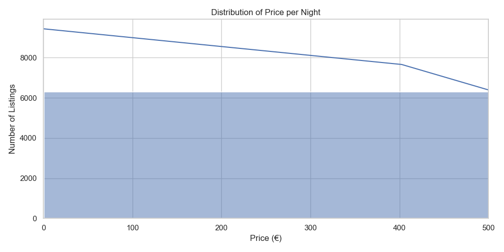
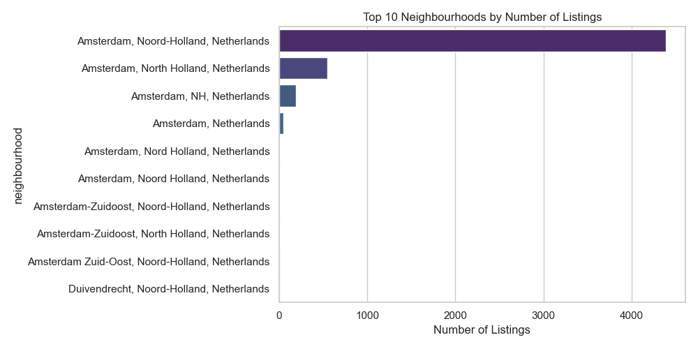

# Amsterdam Airbnb Data Pipeline

A mini data engineering project that extracts, transforms, and visualizes Airbnb listings in Amsterdam using open data.

## What This Project Does

- Loads Airbnb listing data from [InsideAirbnb.com](http://insideairbnb.com/get-the-data.html)
- Cleans and filters key columns
- Creates a new feature: `price_per_night`
- Generates visual insights:
  - Price distribution histogram
  - Top neighborhoods by listing count

## Tech Stack

- Python (3.10)
- Pandas
- Matplotlib, Seaborn
- VS Code
- Git

## Sample Visualizations

**Distribution of Price per Night**  

**Top 10 Neighbourhoods**  

## 📁 Dataset

Source: [Inside Airbnb](http://insideairbnb.com/get-the-data.html)  
File: `listings.csv.gz` (Amsterdam, most recent)

## Author

[Edita Kristofora](https://www.linkedin.com/in/edita-kristofora)  
Data & Behavioural Science | Python | R | Creative thinker
